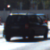
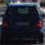
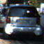
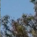
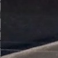
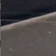
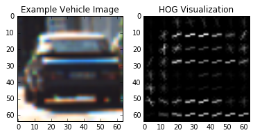
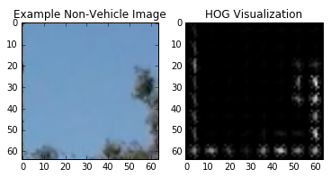
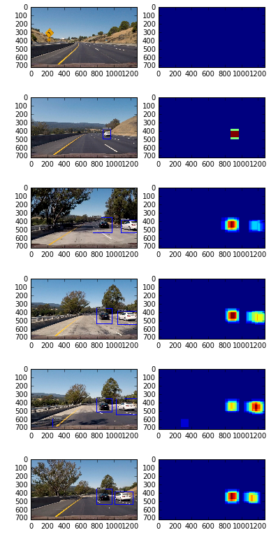

## Vehicle Detection

---

**Vehicle Detection Project**

The goals / steps of this project are the following:

* Perform a Histogram of Oriented Gradients (HOG) feature extraction on a labeled training set of images and train a classifier Linear SVM classifier
* Optionally, you can also apply a color transform and append binned color features, as well as histograms of color, to your HOG feature vector. 
* Note: for those first two steps don't forget to normalize your features and randomize a selection for training and testing.
* Implement a sliding-window technique and use your trained classifier to search for vehicles in images.
* Run your pipeline on a video stream (start with the test_video.mp4 and later implement on full project_video.mp4) and create a heat map of recurring detections frame by frame to reject outliers and follow detected vehicles.
* Estimate a bounding box for vehicles detected.

[//]: # (Image References)
[image1]: ./examples/car_not_car.png
[image2]: ./examples/HOG_example.jpg
[image3]: ./examples/sliding_windows.jpg
[image4]: ./examples/sliding_window.jpg
[image5]: ./examples/bboxes_and_heat.png
[image6]: ./examples/labels_map.png
[image7]: ./examples/output_bboxes.png
[video1]: ./project_video.mp4

## [Rubric](https://review.udacity.com/#!/rubrics/513/view) Points
### Here I will consider the rubric points individually and describe how I addressed each point in my implementation.  

---

### Histogram of Oriented Gradients (HOG)

#### 1. Explain how (and identify where in your code) you extracted HOG features from the training images.

The code for this step is contained in the `vehicleDetectUtil.py`.  
I started by reading in all the `vehicle` and `non-vehicle` images in `train_svm.ipynb`.  
Here is an example of one of each of the `vehicle` classes:

   

Here is an example of one of each of the `non-vehicle` classes:

   

I then explored different color spaces and different `skimage.hog()` parameters (`orientations`, `pixels_per_cell`, and `cells_per_block`).  I grabbed random images from each of the two classes and displayed them to get a feel for what the `skimage.hog()` output looks like.

Here is an example using the `YCrCb` color space and HOG parameters of `orientations=8`, `pixels_per_cell=(8, 8)` and `cells_per_block=(2, 2)`:

| |
|:---:|
| HOG Visualization(Vehicle) |


| |
|:---:|
| HOG Visualization(Non-Vehicle) |

#### 2. Explain how you settled on your final choice of HOG parameters.

I tried and tuned various combinations of parameters and color spaces to get a high test accuracy of the SVC.

My final choice of parameters are:

| Parameter | Value  |
|---|---|
| orientations | 9 |
| pixels_per_cell |  (8, 8) |
| cells_per_block | (2, 2) |

#### 3. Describe how (and identify where in your code) you trained a classifier using your selected HOG features (and color features if you used them).

I trained a linear SVM using in `train_svm.ipynb`.
I combined spatial features, histogram features and HOG features in `extract_features()` of `vehicleDetectUtil.py`.

- Spatial features is extracted in `get_spatial_features()` of `vehicleDetectUtil.py`.
- Histogram features is extracted in `get_colorHist_features()` of `vehicleDetectUtil.py`.
- HOG features is extracted in `get_hog_features()` of `vehicleDetectUtil.py`.

The resulting accuracy is 0.9927.

### Sliding Window Search

#### 1. Describe how (and identify where in your code) you implemented a sliding window search.  How did you decide what scales to search and how much to overlap windows?

The sliding window search is implemented in `slide_window()` of `vehicleDetectUtil.py`. 
I decided to search in the image from y-position y_start_stop[0] to y_start_stop[1] in `detect_vihicle.ipynb`. Because, vehicle is often in the lower half of the image.

```python
y_start_stop = [int(img_size[0]/2), img_size[0]-32]
```

And, I decided to use the following window size and overlap size.  
I decided these values by trying some patterns.

```python
windowSizes = [96, 128, 145]
windowOverlap = 0.75
```

#### 2. Show some examples of test images to demonstrate how your pipeline is working.  What did you do to optimize the performance of your classifier?

Ultimately I searched on two scales using YCrCb 3-channel HOG features plus spatially binned color and histograms of color in the feature vector, which provided a nice result. Here are some example images:



---

### Video Implementation

#### 1. Provide a link to your final video output.  Your pipeline should perform reasonably well on the entire project video (somewhat wobbly or unstable bounding boxes are ok as long as you are identifying the vehicles most of the time with minimal false positives.)

Here's a [link to my video result](https://github.com/atinfinity/CarND-Vehicle-Detection/blob/master/output_images/project_video.mp4)


#### 2. Describe how (and identify where in your code) you implemented some kind of filter for false positives and some method for combining overlapping bounding boxes.

I recorded the positions of positive detections in each frame of the video.  From the positive detections I created a heatmap and then thresholded that map to identify vehicle positions.  I then used `scipy.ndimage.measurements.label()` to identify individual blobs in the heatmap.  I then assumed each blob corresponded to a vehicle.  I constructed bounding boxes to cover the area of each blob detected.  

Here's an example result showing the heatmap from a series of frames of video, the result of `scipy.ndimage.measurements.label()` and the bounding boxes then overlaid on the last frame of video:

---

### Discussion

#### 1. Briefly discuss any problems / issues you faced in your implementation of this project.  Where will your pipeline likely fail?  What could you do to make it more robust?

I expect that current pipeline fail in case of NOT defined scale vehicle.
But, increasing the variations of the scale slows down the performance.
And, current pipeline uses handcrafted features. So, it is necessary to design features manually when I hope to improve accuracy of detecion.

I think these problems can be solved with a CNN based algorithm(SSD, YOLO etc...).